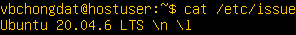
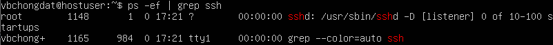
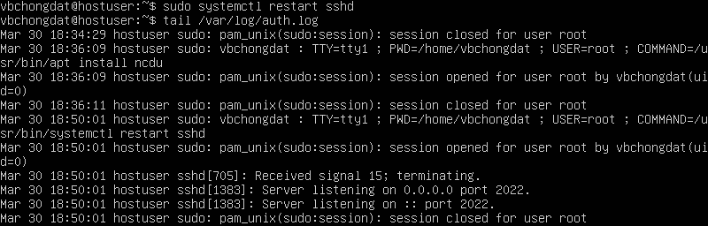

# Операционные системы UNIX/Linux (Базовый).

Установка и обновления системы Linux. Основы администрирования.

## Contents

  1 [Установка ОС](#part-1-установка-ос)  
  2 [Создание пользователя](#part-2-создание-пользователя)  
  3 [Настройка сети ОС](#part-3-настройка-сети-ос)   
  4 [Обновление ОС](#part-4-обновление-ос)  
  5 [Использование команды  sudo](#part-5-использование-команды-sudo)  
  6 [Установка и настройка службы времени](#part-6-установка-и-настройка-службы-времени)  
  7 [Установка и использование текстовых редакторов](#part-7-установка-и-использование-текстовых-редакторов)  
  8 [Установка и базовая настройка сервиса SSHD](#part-8-установка-и-базовая-настройка-сервиса-sshd)   
  9 [Установка и использование утилит top, htop](#part-9-установка-и-использование-утилит-top-htop)   
  10 [Использование утилиты fdisk](#part-10-использование-утилиты-fdisk)   
  11 [Использование утилиты df](#part-11-использование-утилиты-df)    
  12 [Использование утилиты du](#part-12-использование-утилиты-du)    
  13 [Установка и использование утилиты ncdu](#part-13-установка-и-использование-утилиты-ncdu)    
  14 [Работа с системными журналами](#part-14-работа-с-системными-журналами)     
  15 [Использование планировщика заданий CRON](#part-15-использование-планировщика-заданий-cron)    

## Part 1. Установка ОС
**== Задание ==**

##### Установить **Ubuntu 20.04 Server LTS** без графического интерфейса. (Используем программу для виртуализации - VirtualBox)

- Графический интерфейс должен отсутствовать.

- Узнайте версию Ubuntu, выполнив команду `cat /etc/issue`
- Вставьте скриншот с выводом команды.

**== Ответ ==**

- Система установлена

## Part 2. Создание пользователя

**== Задание ==**

##### Создать пользователя, отличного от пользователя, который создавался при установке. Пользователь должен быть добавлен в группу `adm`.

- Вставьте скриншот вызова команды для создания пользователя
- Новый пользователь должен быть в выводе команды `cat /etc/passwd`
- Вставьте скриншот с выводом команды

**== Ответ ==**

- Создание нового пользователя с добавлением его в группу adm `sudo useradd -G adm part2`

- Проверка внесения пользователя в группу adm `vi /etc/group`

- Новый пользователь должен быть в выводе команды `cat /etc/passwd`

## Part 3. Настройка сети ОС

**== Задание ==**

##### Задать название машины вида user-1  
##### Установить временную зону, соответствующую вашему текущему местоположению.  
##### Вывести названия сетевых интерфейсов с помощью консольной команды.
- В отчёте дать объяснение наличию интерфейса lo.  
##### Используя консольную команду получить ip адрес устройства, на котором вы работаете, от DHCP сервера. 
- В отчёте дать расшифровку DHCP.  
##### Определить и вывести на экран внешний ip-адрес шлюза (ip) и внутренний IP-адрес шлюза, он же ip-адрес по умолчанию (gw). 
##### Задать статичные (заданные вручную, а не полученные от DHCP сервера) настройки ip, gw, dns (использовать публичный DNS серверы, например 1.1.1.1 или 8.8.8.8).  
##### Перезагрузить виртуальную машину. Убедиться, что статичные сетевые настройки (ip, gw, dns) соответствуют заданным в предыдущем пункте.  

- В отчёте опишите, что сделали для выполнения всех семи пунктов (можно как текстом, так и скриншотами).
- Успешно пропинговать удаленные хосты 1.1.1.1 и ya.ru и вставить в отчёт скрин с выводом команды. В выводе команды должна быть фраза "0% packet loss".

**== Ответ ==**

1) Изменение имени машины

  Смена старого имени `hostname`

  

  на новое: `sudo hostnamectl set-hostname user-1`

  

2) Установка временной зоны `sudo dpkg-reconfigure tzdata`

  

3) Вывод названия сетевых интерфейсов с помощью консольной команды

  `ip a`

  

  lo - (loopback device) виртуальный интерфейс, присутствующий по умолчанию в любом Linux. Он используется для отладки сетевых программ и запуска серверных приложений на локальной машине.

4) Получение ip устройства от DHCP сервера `sudo dhclient -v`

  

DHCP (англ. Dynamic Host Configuration Protocol — протокол динамической настройки узла) — сетевой протокол, позволяющий сетевым устройствам автоматически получать IP-адрес и другие параметры, необходимые для работы в сети TCP/IP. Данный протокол работает по модели «клиент-сервер». Для автоматической конфигурации компьютер-клиент на этапе конфигурации сетевого устройства обращается к так называемому серверу DHCP и получает от него нужные параметры.

5) Внешний и внутренний ip адрес шлюза

  - Внешний ip шлюза `wget eth0.me -q -O -` 

  

  - Внутренний ip шлюза `hostname -I`

  

6) Задание статичных настроек ip, gw, dns

  Смотрим файл конфигурации Netplan до изменений командой `cat /etc/netplan/00-installer-config.yaml`

  

  Меняем содержимое файла открыв файл в nano с помощью команды `sudo nano /etc/netplan/00-installer-config.yaml`
  Настройки после редактирования

  

7) Проверка статичных настроек после перезагрузки `cat /etc/netplan/00-installer-config.yaml`

   Настройки не изменились

  
  
  Пингование удаленных хостов 1.1.1.1 и ya.ru на основе отправки 30 пакетов прошло успешно

  - `ping 1.1.1.1 -с 30`

  

  

  - `ping ya.ru -с 30`

  

  

  
## Part 4. Обновление ОС

**== Задание ==**

##### Обновить системные пакеты до последней на момент выполнения задания версии.  

- После обновления системных пакетов, если ввести команду обновления повторно, должно появится сообщение, что обновления отсутствуют.
- Вставить скриншот с этим сообщением в отчёт.

**== Ответ ==**

Для обновления системных пакетов используем команду  `sudo apt update && sudo apt upgrade`

После повторного введения команды получим следующий результат:

## Part 5. Использование команды **sudo**

**== Задание ==**

##### Разрешить пользователю, созданному в [Part 2](#part-2-создание-пользователя), выполнять команду sudo.

- В отчёте объяснить *истинное* назначение команды sudo (про то, что это слово - "волшебное", писать не стоит).  
- Поменять hostname ОС от имени пользователя, созданного в пункте [Part 2](#part-2-создание-пользователя) (используя sudo).
- Вставить скрин с изменённым hostname в отчёт.

**== Ответ ==**

  1) Даем права на sudo пользователю newuser командой `sudo usermod -aG sudo newuser`

  2) sudo (англ. Substitute User and do, дословно «подменить пользователя и выполнить») — программа для системного администрирования UNIX-систем, позволяющая делегировать те или иные привилегированные ресурсы пользователям с ведением протокола работы. Основная идея — дать пользователям как можно меньше прав, при этом достаточных для решения поставленных задач. sudo позволяет выполнить одну или несколько команд от имени текущего пользователя, которому система временно повышает привилегии, а после выполнения команды — снова снижает их.

  3) Обновление hostname: `sudo su newuser`, `sudo hostnamectl set-hostname hostuser`, `hostnamectl`

  
  

## Part 6. Установка и настройка службы времени

**== Задание ==**

##### Настроить службу автоматической синхронизации времени.  

- Вывести время, часового пояса, в котором вы сейчас находитесь.
- Вывод следующей команды должен содержать `NTPSynchronized=yes`: \
  `timedatectl show`
- Вставить скрины с корректным временем и выводом команды в отчёт.

**== Ответ ==**

Вывод времени, часового пояса, в котором сейчас находимся (`date`):

Вывод следующей команды (`timedatectl show`) содержит `NTPSynchronized=yes`:

## Part 7. Установка и использование текстовых редакторов 

**== Задание ==**

##### Установить текстовые редакторы **VIM** (+ любые два по желанию **NANO**, **MCEDIT**, **JOE** и т.д.)  
##### Используя каждый из трех выбранных редакторов, создайте файл *test_X.txt*, где X -- название редактора, в котором создан файл. Напишите в нём свой никнейм, закройте файл с сохранением изменений.  
- В отчёт вставьте скриншоты:
  - Из каждого редактора с содержимым файла перед закрытием.
- В отчёте укажите, что сделали для выхода с сохранением изменений.
##### Используя каждый из трех выбранных редакторов, откройте файл на редактирование, отредактируйте файл, заменив никнейм на строку "21 School 21", закройте файл без сохранения изменений.
- В отчёт вставьте скриншоты:
    - Из каждого редактора с содержимым файла после редактирования.
- В отчёте укажите, что сделали для выхода без сохранения изменений.
##### Используя каждый из трех выбранных редакторов, отредактируйте файл ещё раз (по аналогии с предыдущим пунктом), а затем освойте функции поиска по содержимому файла (слово) и замены слова на любое другое.
- В отчёт вставьте скриншоты:
    - Из каждого редактора с результатами поиска слова.
    - Из каждого редактора с командами, введёнными для замены слова на другое.

**== Ответ ==**

  1) Создание файла
   - при помощи nano `nano test_nano.txt`

      

     для выхода с сохранением нажимаем ^x, y, enter

   - при помощи vim `vim test_vim.txt` (для ввода текста нажимаем i)

      

     для выхода с сохранением нажимаем esc shift + ZZ

   - устанавливаем редактор joe `sudo apt install joe`
   - создаем файл при помощи joe `joe test_joe.txt`

      

     для выхода с сохранением нажимаем ^k q y
 
 2) Выход без сохранения
   - открываем файл при помощи nano `nano test_nano.txt`

   отредактированный файл:

   

   для выхода без сохранения нажимаем ^x, n

  - открываем файл при помощи vim `vim test_vim.txt`

   отредактированный файл:

   

   для выхода без сохранения нажимаем esc :q! enter

  - открываем файл при помощи joe `joe test_joe.txt`

   отредактированный файл:

   

   для выхода без сохранения нажимаем ^k q n  
  
3) Поиск и замена слова. Во всех трех файлай никнейм предварительно заменен на "21 School 21" и "ch on gd at" по аналогии с предыдущим пунктом.

  - открываем файл при помощи nano `nano test_nano.txt`\
   для поиска используем ^w \
   для замены используем ^\ \
   результат поиска слова "School":

   

   результат замены слова:

   

  - открываем файл при помощи vim `vim test_vim.txt`\
   для поиска используем :s/ \
   для замены используем :s/предыдущий текст/новый текст\
   результат поиска слова "School":

   

   результат замены слова:

   

  - открываем файл при помощи joe `joe test_joe.txt`\
   для поиска используем ^k f \
   для замены используем ^ k f enter r enter y \
   результат поиска слова "School":

   

   результат замены слова:

   

## Part 8. Установка и базовая настройка сервиса **SSHD**

**== Задание ==**

##### Установить службу SSHd.  
##### Добавить автостарт службы при загрузке системы.  
##### Перенастроить службу SSHd на порт 2022.  
##### Используя команду ps, показать наличие процесса sshd. Для этого к команде нужно подобрать ключи.
- В отчёте объяснить значение команды и каждого ключа в ней.
##### Перезагрузить систему.
- В отчёте опишите, что сделали для выполнения всех пяти пунктов (можно как текстом, так и скриншотами).
- Вывод команды netstat -tan должен содержать  \
`tcp 0 0 0.0.0.0:2022 0.0.0.0:* LISTEN`  \
(если команды netstat нет, то ее нужно установить)
- Скрин с выводом команды вставить в отчёт.
- В отчёте объяснить значение ключей -tan, значение каждого столбца вывода, значение 0.0.0.0.

**== Ответ ==**

1) `sudo apt install openssh-server` (Установка службы SSHd)

2) `sudo systemctl enable ssh` (Автостарт при загрузке системы)
 - служба SSHd работает

 

3) Для изменения порта на 2022 требуется отредактировать файл `sudo nano /etc/ssh/sshd_config`

 

 для применения изменений: `sudo service ssh restart`

4) Вывод процесса ssh `ps -ef | grep ssh`

 

 - команда ps отображает список текущих процессов
 - флаг -е показывает все процессы, а -f показывает полную информацию
 - sshd - это служба, принимающая запросы на соединения от клиентов. Обычно она запускается при загрузке системы из /etc/rc. Для каждого нового соединения создаётся новый экземпляр службы. Ответвлённый экземпляр обрабатывает обмен ключами, шифрование, аутентификацию, выполнение команд и обмен данными.

5) Вывод команды `netstat -tan` содержит `tcp 0 0 0.0.0.0:2022 0.0.0.0:* LISTEN`

 

 - netstat(network status) отображает активные TCP-соединения, порты, которые прослушивает компьютер, статистику Ethernet, таблицу IP-маршрутизации.
 - Ключи tan: 
   - -t отображение только TCP-портов
   - -a отображение всех открытых портов (как TCP, так и UDP)
   - -n отображение портов в числовом формате, без имен хостов и сервисов

- Значение столбцов вывода: 
    - Proto - название протокола 
    - Recv-Q - очередь получения сети 
    - Send-Q - сетевая очередь отправки 
    - Local Address - локальный IP-адрес, участвующий в соединении или связанный со службой, участвующей в соединении 
    - Foreign Address - внешний IP-адрес, учавствующий в создании соединения
    - State - состояние соединение
- Значение 0.0.0.0 - означает, что в соединении могут использоваться все IP-адреса на локальном компьютере.

## Part 9. Установка и использование утилит **top**, **htop**

**== Задание ==**

##### Установить и запустить утилиты top и htop.  

- По выводу команды top определить и написать в отчёте:
  - uptime
  - количество авторизованных пользователей
  - общую загрузку системы
  - общее количество процессов
  - загрузку cpu
  - загрузку памяти
  - pid процесса занимающего больше всего памяти
  - pid процесса, занимающего больше всего процессорного времени
- В отчёт вставить скрин с выводом команды htop:
  - отсортированному по PID, PERCENT_CPU, PERCENT_MEM, TIME
  - отфильтрованному для процесса sshd
  - с процессом syslog, найденным, используя поиск 
  - с добавленным выводом hostname, clock и uptime  

**== Ответ ==**

- Вывод команды top с сортировкой по памяти Shift+M, по процессорному времени Shift+T

 

  - uptime: 18 min
  - количество авторизованных пользователей: 1
  - общую загрузку системы: 0.00
  - общее количество процессов: 95
  - загрузку cpu: 0%
  - загрузку памяти: 12.1%
  - pid процесса занимающего больше всего памяти:  358
  - pid процесса, занимающего больше всего процессорного времени: 1

- Вывод команды htop: сортировка F6, фильтр F4, поиск F3, добавить вывод F2
  - отсортированный по PID

  

  - отсортированный по PERCENT_CPU

  

  - отсортированный по PERCENT_MEM

  

  - отсортированный по TIME

  

  - отфильтрованному для процесса sshd

  

  - с процессом syslog, найденным, используя поиск 

  

  - с добавленным выводом hostname, clock и uptime 

  

## Part 10. Использование утилиты **fdisk**

**== Задание ==**

##### Запустить команду fdisk -l.

- В отчёте написать название жесткого диска, его размер и количество секторов, а также размер swap.

**== Ответ ==**

- `sudo fdisk -l`

 

   - название жесткого диска: sda 
   - размер 10 GiB
   - количество секторов 20971520
   - размер swap  0 GB
  
  Раздел swap может как создаваться в системе автоматически так и нет используя команду `free -h` можно увидеть размер swap.

   

## Part 11. Использование утилиты **df** 

**== Задание ==**

##### Запустить команду df.  
- В отчёте написать для корневого раздела (/):
  - размер раздела
  - размер занятого пространства
  - размер свободного пространства
  - процент использования
- Определить и написать в отчёт единицу измерения в выводе.  

##### Запустить команду df -Th.
- В отчёте написать для корневого раздела (/):
    - размер раздела
    - размер занятого пространства
    - размер свободного пространства
    - процент использования
- Определить и написать в отчёт тип файловой системы для раздела.

**== Ответ ==**
- Запущена команда df

 

- Для корневого раздела (/):
  - размер раздела: 8408452
  - размер занятого пространства: 4165992
  - размер свободного пространства: 3793744
  - процент использования: 53%
- Единица измерения: Килобайт

- Запущена команда df -Th

 

- Для корневого раздела (/):
    - размер раздела: 8.1 ГБ
    - размер занятого пространства: 4 ГБ
    - размер свободного пространства: 3.7 ГБ
    - процент использования: 53%
- Тип файловой системы для раздела: ext4

## Part 12. Использование утилиты **du**

**== Задание ==**

##### Запустить команду du.
##### Вывести размер папок /home, /var, /var/log (в байтах, в человекочитаемом виде)
##### Вывести размер всего содержимого в /var/log (не общее, а каждого вложенного элемента, используя *)

- В отчёт вставить скрины с выводом всех использованных команд.

**== Ответ ==**

 - Запущена команда du

 

 - Размер папок /home, /var, /var/log
   - в байтах `sudo du -s /home && sudo du -s /var && sudo du -s /var/log`

    

   - в человекочитаемом виде `sudo du -sh /home && sudo du -sh /var && sudo du -sh /var/log`

    
    
 - Размер всего содержимого в /var/log `sudo du -ha /var/log/*`

  
  

## Part 13. Установка и использование утилиты **ncdu**

**== Задание ==**

##### Установить утилиту ncdu.
##### Вывести размер папок /home, /var, /var/log.

- Размеры должны примерно совпадать с полученными в [Part 12](#part-12-использование-утилиты-du).

- В отчёт вставить скрины с выводом использованных команд.

**== Ответ ==**

 - Установка `sudo apt install ncdu`
 - `ncdu /home`

  

 - `ncdu /var`

  

 - `ncdu /var/log`

  

## Part 14. Работа с системными журналами

**== Задание ==**

##### Открыть для просмотра:
##### 1. /var/log/dmesg
##### 2. /var/log/syslog
##### 3. /var/log/auth.log  

- Написать в отчёте время последней успешной авторизации, имя пользователя и метод входа в систему.
- Перезапустить службу SSHd.
- Вставить в отчёт скрин с сообщением о рестарте службы (искать в логах).

**== Ответ ==**

1) `tail /var/log/dmesg`

   

2) `tail /var/log/syslog`

   

3) `tail /var/log/auth.log`

   

- Время последней успешной авторизации 20 Марта 18:27:48
  - Имя пользователя 
  - Метод входа в систему systemd-logind
- Перезапустить службу SSHd `sudo systemctl restart sshd`
- Cкрин с сообщением о рестарте службы

 

## Part 15. Использование планировщика заданий **CRON**

**== Задание ==**

##### Используя планировщик заданий, запустите команду uptime через каждые 2 минуты.
- Найти в системных журналах строчки (минимум две в заданном временном диапазоне) о выполнении.
- Вывести на экран список текущих заданий для CRON.
- Вставить в отчёт скрины со строчками о выполнении и списком текущих задач.

##### Удалите все задания из планировщика заданий.
- В отчёт вставьте скрин со списком текущих заданий для CRON.

**== Ответ ==**

1) Используя планировщик заданий, запустить команду uptime через каждые 2 минуты

 `crontab -e`

 

- Найти в системных журналах строчки (минимум две в заданном временном диапазоне) о выполнении

 `tail /var/log/syslog`

 

- Вывести на экран список текущих заданий для CRON

 `crontab -l`

 

2) Удалить все задания из планировщика заданий

 `crontab -r`

 